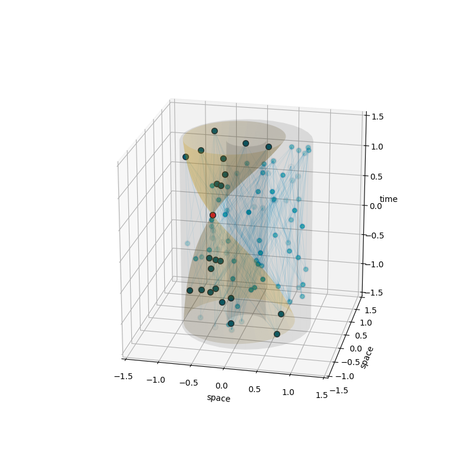

# Introduction
This repository contains Python modules for numerical investigations of causal set theory. Causal set theory is a framework for quantum gravity where the classical spacetime manifold is replaces by the discrete structure of locally finite, partially ordered sets i.e., causal sets or short causets.

The modules developed in this project implement methods to create causal sets generically, define them using coordinates of a spacetime manifold, or generate them via the sprinkling process (a Poisson process) on any implemented spacetime (`spacetimes.py` currently supports flat spacetime, de Sitter, Anti-de Sitter, and some first developments of black hole spacetimes).

An instance of `Causet` (`causets.py`) is a set of `CausetEvent` (`events.py`) that has additional functionality. Each instance of `CausetEvent` can be used in logical expressions, e.g. for two instance `a` and `b`, `a < b` is True if and only if `a` is in the causal past of `b`. The `Causet` class provides methods that return subsets like `Layers`, `Ranks`, the future and past of event as sets of `CausetEvent`, the future and past infinities, causal paths, and much more. The events of a causet can be labelled by different properties.

The class `EmbeddedCauset` extends `Causet` and is able to handle the coordinates of events (their embedding) in a given region of a spacetime. Instances of this class can be plotted (including support for light-cone plotting). The subclass `SprinkledCauset` further adds the functionality to create a new causet or add more events to it via sprinkling a given spacetime region.

# Examples and Testing
Most of the implemented code has been tested with the `unittest` module. All test modules are named as `test_...` and contain some principle examples. 

A simple demonstration is provided by the file `demo.py` that generates a sprinkle in 3-dimensional de Sitter space, as shown by the following example plot:

Using methods of `matplotlib`, it is also possible to generate animations, for example:

# Past Development
The original code was developed in MATLAB R2019a and R2020a as part of my PhD projects at the University of York (from 2017 to 2021). Most parts of the MATLAB source code are in separate repositories:
* [Local structure of sprinkled causal sets, part 1/2 - 'diamondsprinkling'](https://github.com/c-minz/diamondsprinkling)
* [Local structure of sprinkled causal sets, part 2/2 - 'diamondresults'](https://github.com/c-minz/diamondresults)
* [MATLAB object classes and other - 'MATLAB-causets'](https://github.com/c-minz/MATLAB-causets)

In order to make the code usable without a MATLAB license, I started to convert it to Python source code (Python 3.8.3) with mypy typing support.

The Python classes and functions are documented so that the help commands within Python give further information.

# Future Development
My development ideas include: 
1. Visualization of generic causets as (Hasse) diagrams
2. Methods for spacetime triangulation

If you wish to contribute to the project, please get in contact via email:
christoph(dot)minz[at]gmail(dot)com

# License Information
The source code is published under the BSD 3-Clause License, see [license file](LICENSE.md).

Copyright (c) 2020-2021, Christoph Minz
