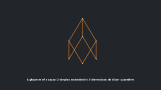

# Introduction
Causal set theory is a framework for quantum gravity where the classical spacetime manifold is replaces by the discrete structure of locally finite, partially ordered sets i.e., causal sets or short causets. This repository contains Python modules for numerical investigations of causal set theory.

The modules developed in this project implement methods to create causal sets generically, define them using coordinates of a spacetime manifold, or generate them via the sprinkling process (a Poisson process) on any implemented spacetime (`spacetimes.py` currently supports flat spacetime, de Sitter, Anti-de Sitter, and some first developments of black hole spacetimes).

An instance of `Causet` (`causet.py`) is a set of `CausetEvent` (`causetevent.py`) that has additional functionality. Each instance of `CausetEvent` can be used in logical expressions, e.g. for two instance `a` and `b`, `a < b` is True if and only if `a` is in the causal past of `b`. The `Causet` class provides methods that return subsets like `Layers`, `Ranks`, the future and past of event as sets of `CausetEvent`, the future and past infinities, causal paths, and much more.

The class `EmbeddedCauset` extends `Causet` and is able to handle the coordinates of events (their embedding) in a given region of a spacetime. Instances of this class can be plotted (including light-cones where implemented). The subclass `SprinkledCauset` further adds the functionality to create a new causet or add more events to it via sprinkling the spacetime region.

# Examples and testing
Most of the implemented code has been tested in `unittest` modules, named `test_...`. Some of these modules also contain causet examples. 

A simple demonstration is given in the file `demo.py`, which generates a sprinkle in 3-dimensional de Sitter space, for example, as shown by the following plot:

Using methods of `matplotlib`, the causet plotting functions may also be used to create animations. For example, I created an animation of a 2-simplex embedded in de Sitter spacetime. The source code of this example is not included in this repository, but the animation is available at my YouTube channel: 

# Progress of the source code development
The original code was developed in MATLAB R2019a and R2020a as part of my PhD projects at the University of York (from 2017 to 2021). Most parts of the MATLAB source code are in separate repositories:
* [Local structure of sprinkled causal sets, part 1/2 - 'diamondsprinkling'](https://github.com/c-minz/diamondsprinkling)
* [Local structure of sprinkled causal sets, part 2/2 - 'diamondresults'](https://github.com/c-minz/diamondresults)
* [MATLAB object classes and other - 'MATLAB-causets'](https://github.com/c-minz/MATLAB-causets)

In order to make the code usable without a MATLAB license, I started to convert it to the Python modules (Python 3.8.3) with mypy typing support that are in this repository.

The Python modules (classes and functions) are documented (use `help [class/function name]` in Python).

Further development ideas are:
1. Visualization of generic causets as (Hasse) diagrams
2. Methods for finding an embedding of a general causal set in a spacetime manifold, or a "reconstruction" of a spacetime manifold

If you wish to contribute to the project, please get in contact via email:
christoph(dot)minz[at]gmail(dot)com

# License information
The source code is published under the BSD 3-Clause License, see [license file](LICENSE.md).

Copyright (c) 2020-2023, Christoph Minz

If you use the source code of this repository (with or without modification), please acknowledge it in your project. I appreciate if you add a link to this repository as reference.
